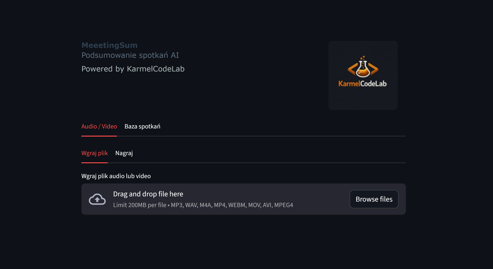
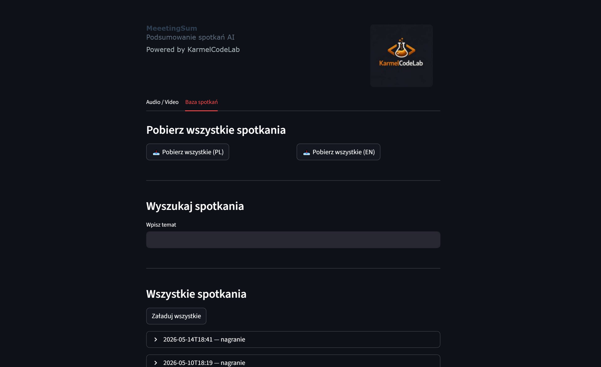
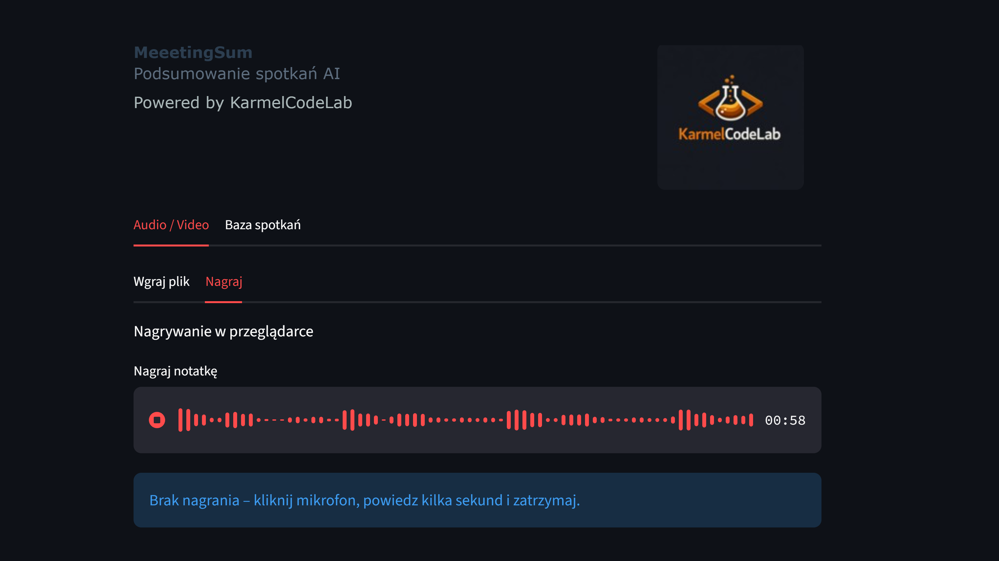
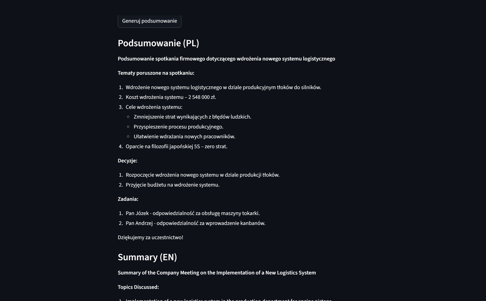
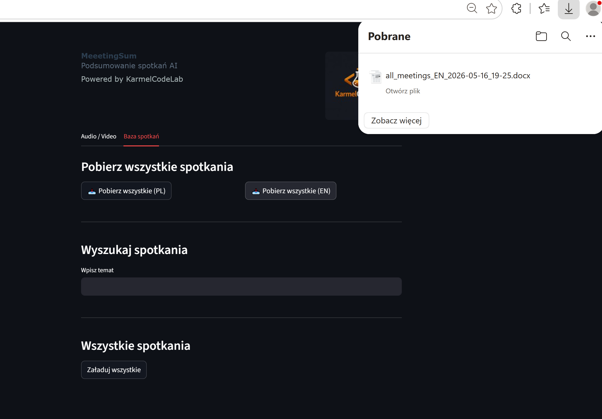

# **MeeetingSum**

MeeetingSum jest to aplikacją, która pozwala tworzyć krókie i konkretne podsumowania długich i nudnych spotkań biznesowych, zebrań biurowych oraz różnego rodzaju mitingów. Wystarczy ją uruchomić na początku spotkania lub wgrać plik audio / video z zebrania i aplikacja po chwili wygeneruje notatkę z najważniejszymy informacjami. Notatka będzie w formie dokumentu word, a więc bez problemu można ją edytować. Dodatkowo jeśli masz wielozjęzyczny zespół wygeneruję Wam notatkę w języku angielskim. Mało tego! Nie musicie nigdzie tych notatek archiwizować. Aplikacja archiwizuje je za Was i ma semantyczną wyszukiwarke. Dzięki temu masz wszystkie mitingi w jednym miejscu.

[Sprawdź aplikacje!](https://meeetingsum.streamlit.app/){ .md-button }

{ style="border-radius:8px; box-shadow: 0 4px 8px rgba(0,0,0,.2);" }

- { .on-glass }
- { .on-glass }
- { .on-glass }
- { .on-glass }

