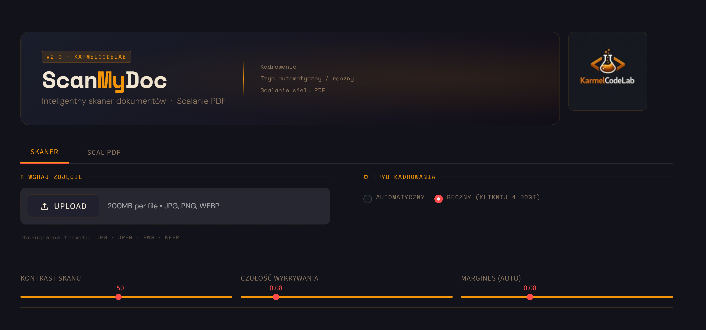
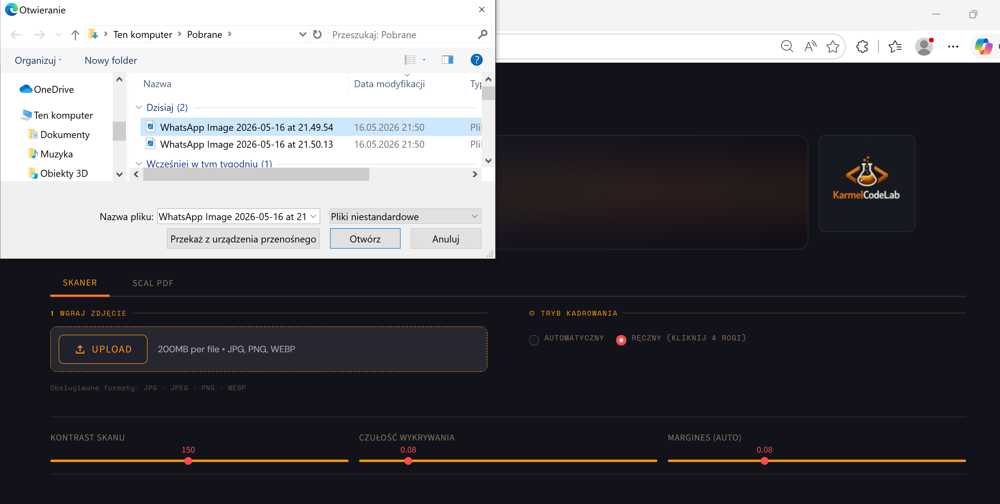
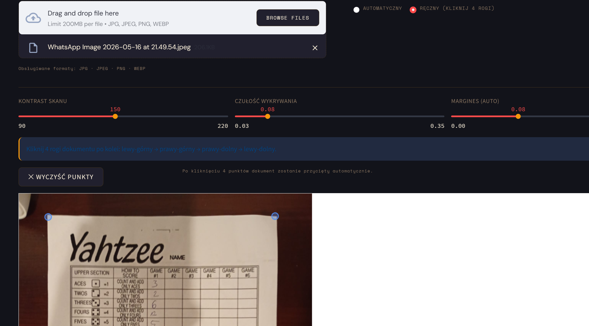
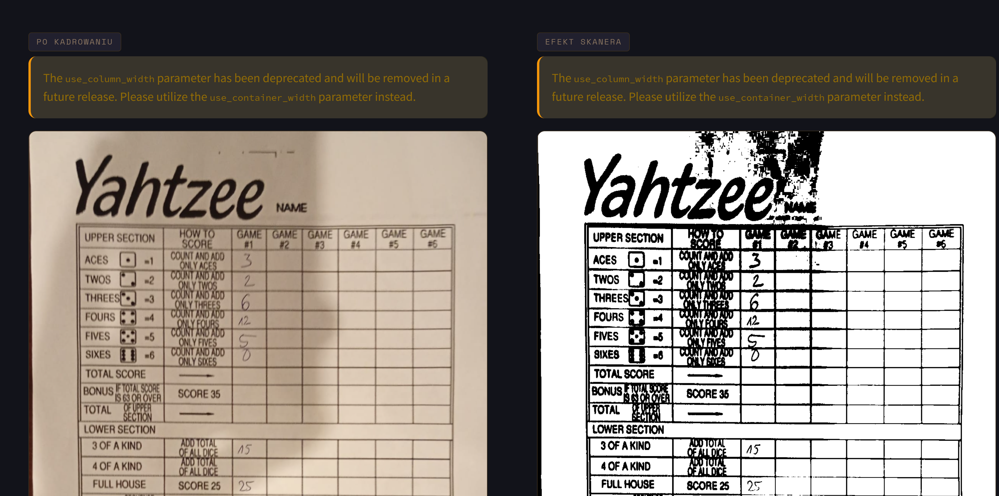
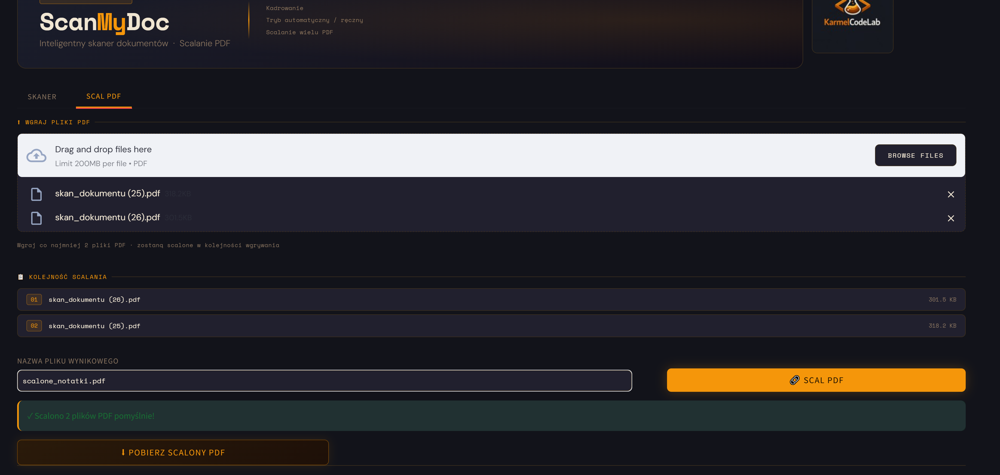

# **ScanMyDoc**

Kiedyś miałem problem, że dostawałem dużo zdjęć dokumentów w formie .jpeg zamiast normalnych skanów ze skanera. W internecie można znaleźć aplikacje któy zamieniają zdjęcia dokumentów w normalne czytelne skany, jednak wszystkie są płatne. Postanowiłem więc sam stworzyć aplikację, któe rozwiąże mój problem. Tak o to powstał ScanMyDoc. Można wgrać zdjęcia dokumentów, przyciąć je i zamienić na skany jak ze skanera biurowego w formacie pdf. Ponadto można połączyć kilka skanów w jeden dokument pdf.

[Sprawdź aplikacje!](https://scanmydoc252525.streamlit.app/){ .md-button }

{ style="border-radius:8px; box-shadow: 0 4px 8px rgba(0,0,0,.2);" }

- { .on-glass }
- { .on-glass }
- { .on-glass }
- { .on-glass }

