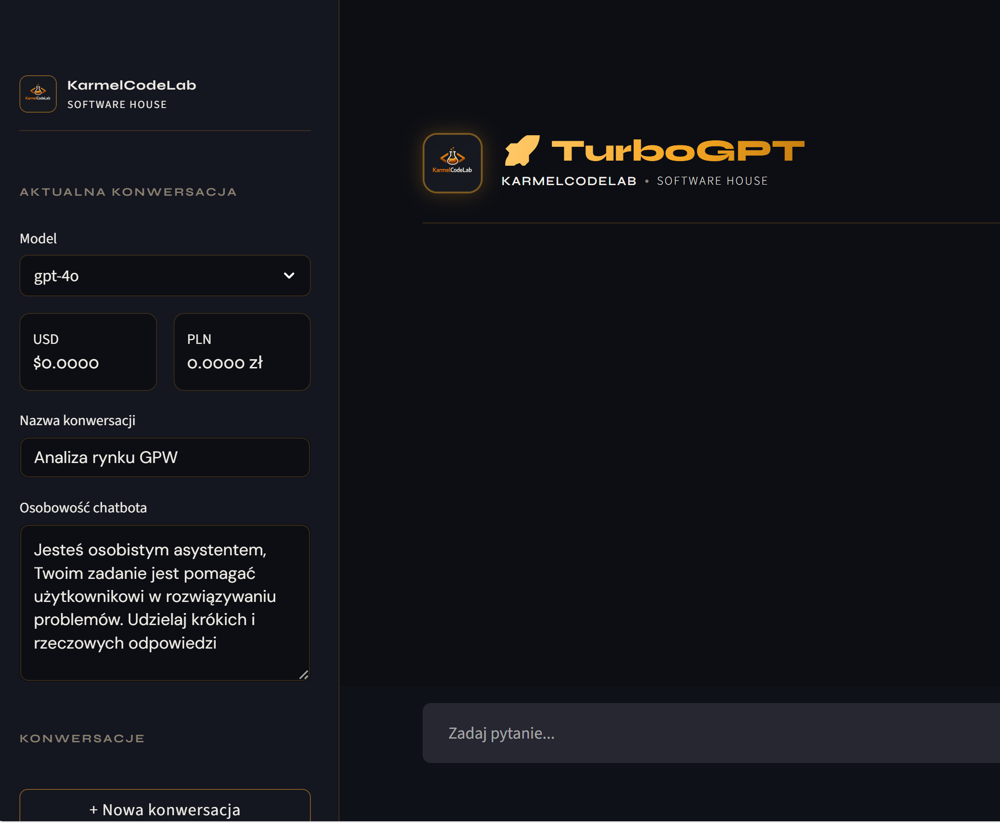
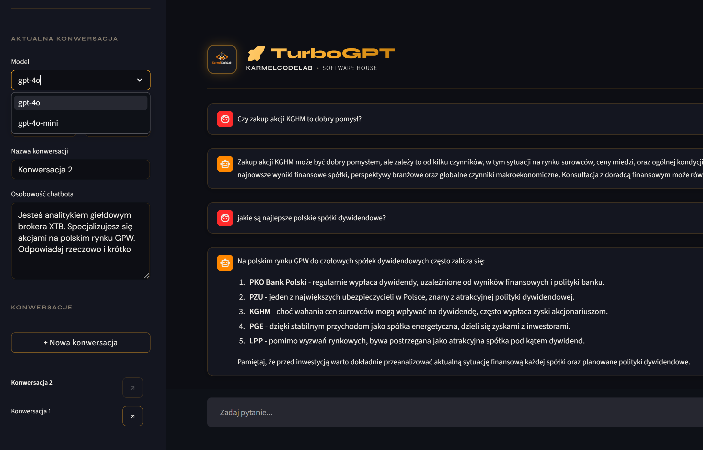
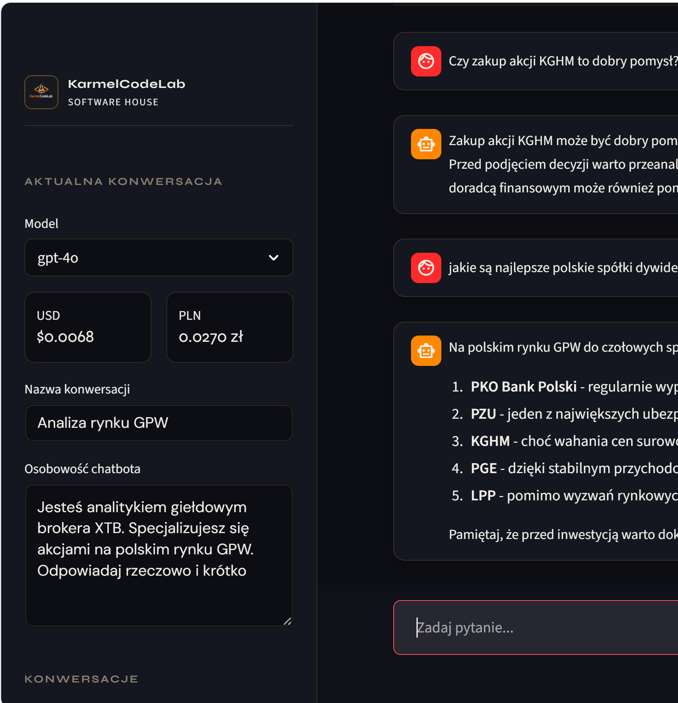
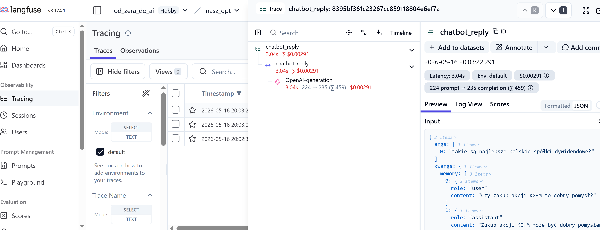

# **TurboGPT**

TurboGPT jest szaloną wariacją na temat najpopularniejszego chatbotu sztucznej inteligencji od OpenAI czyli ChataGPT. Aktualnie być może nie robi takiego wrażenia jednak w momencie gdy go tworzyłem miał do zaoferowania wiele ciekawych możliwości. Użytkownik może sam nadać osobowość sztucznej inteligencji z którą rozmawia, może wybrać model LLM, widzi koszty rozmowy z chatem, zapisuje i tworzy listę konwesacji, którym można nadać własną nazwę. Ponadto aplikacja jest zintegrowana z platformą Langfuse, co pozwala na monitorowanie, debugowanie i analizowanie pracy modelu LLM.

{ style="border-radius:8px; box-shadow: 0 4px 8px rgba(0,0,0,.2);" }

- { .on-glass }
- { .on-glass }

{ style="border-radius:8px; box-shadow: 0 4px 8px rgba(0,0,0,.2);" }